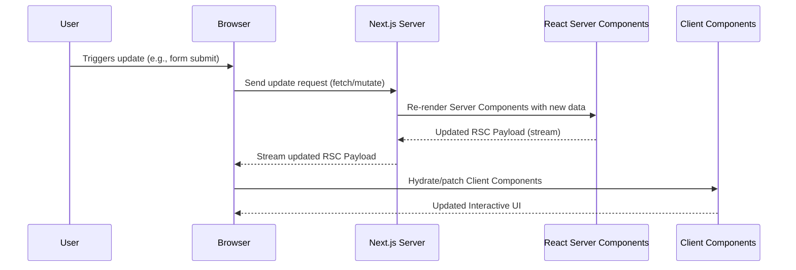

# React Server Components (RSC) Loading in Next.js

React Server Components (RSC) allow you to render components on the server, sending only the necessary data to the client. This enables faster initial loads, smaller client bundles, and improved performance.

---

## How RSC Loading Works in Next.js

1. **Request**: The browser requests a page.
2. **Server Rendering**: Next.js renders Server Components on the server.
3. **Streaming**: The server streams the result (as a special RSC payload) to the client.
4. **Client Rendering**: The client receives the payload, hydrates Client Components, and displays the UI.

---

## Diagram: RSC Loading Flow

```
sequenceDiagram
    participant Browser
    participant NextServer as Next.js Server
    participant RSC as React Server Components
    participant ClientJS as Client Components

    Browser->>NextServer: Request Page
    NextServer->>RSC: Render Server Components
    RSC-->>NextServer: RSC Payload (stream)
    NextServer-->>Browser: Stream RSC Payload
    Browser->>ClientJS: Hydrate Client Components
    ClientJS-->>Browser: Interactive UI
```

## Diagram: RSC Update Time Flow



---

## Initial Load vs. Update: RSC Flow Differences
## Initial Load vs. Update: RSC Flow Differences

| Aspect           | Initial Load                                      |Update (After User Action)|
|------------------|------------------------------------------------------------------------------|     
|-------------------------------------------------------------------------------------------------|
| **Trigger**      | Browser requests a page                                                      | User triggers an update (e.g., form submit, navigation)                     |
| **Server Work**  | Next.js renders Server Components for the first time                         | Next.js re-renders Server Components with new/updated data                  |
| **Streaming**    | Server streams the initial RSC payload to the browser                        | Server streams only the updated RSC payload to the browser             |
| **Client Work**  | Client hydrates Client Components and displays the UI                        | Client hydrates/patches only the affected Client Components            |
| **Performance**  | Optimized for fast time-to-first-byte and progressive rendering              | Optimized for minimal data transfer and fast UI updates                |                          |
|-------------------------------------------------------------------------------------------------|
---

## Key Points

- **Server Components**: Never sent to the client; only their rendered output is.
- **Client Components**: Sent to the browser and hydrated for interactivity.
- **Streaming**: Enables faster time-to-first-byte and progressive rendering.
- **Data Fetching**: Server Components can fetch data directly on the server.
- **Updates**: When data changes, the server re-renders and streams only the necessary updates to the client.
